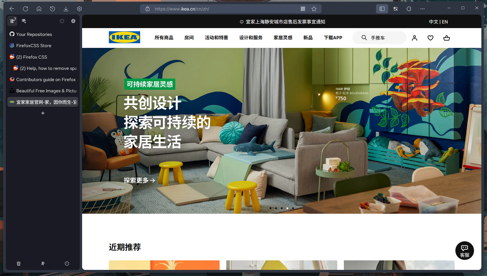
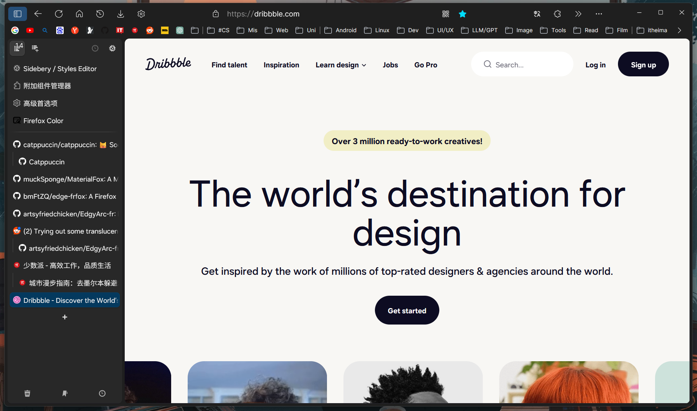
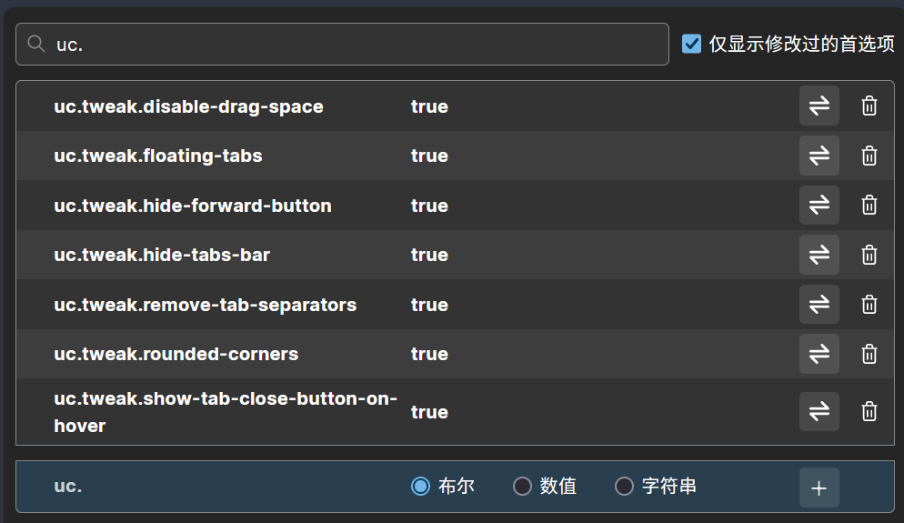
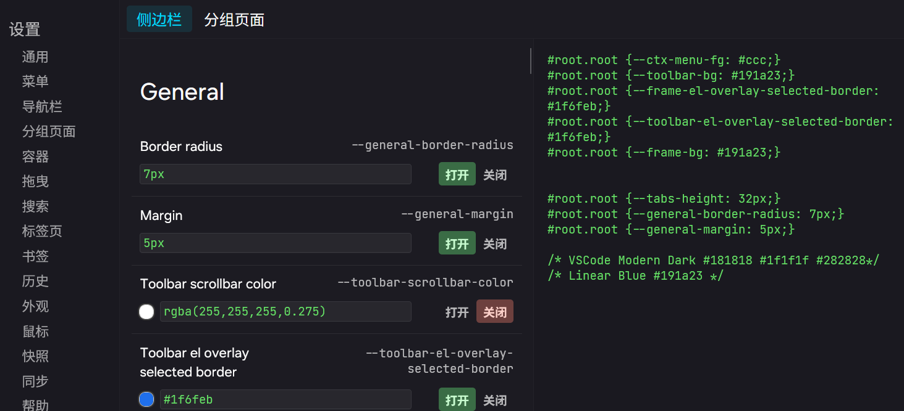

# FirefoxCustomCSSConfig

[](https://badges.toozhao.com/stats/01HPXGQP669GNMEDM0XV87B2TX "Get your own page views count badge on badges.toozhao.com")

## 🤔 这是什么
厌倦了Firefox的传统主题和默认界面？

这是一个使用[userChrome.css](https://support.mozilla.org/en-US/kb/contributors-guide-firefox-advanced-customization)对 '[稳定版Firefox](https://www.mozilla.org/en-US/firefox/new/)' 进行高度自定义的主题

基于 [EdgeFrFox UserChrome Theme](https://github.com/bmFtZQ/edge-frfox/) 和 [Sidebery](https://addons.mozilla.org/firefox/addon/sidebery/) 进行修改

使用userChrome类型的主题不会影响你的用户数据

截图预览:





<br><br>

## 🏷️ 前置版本

仅在Windows下经过测试

Firefox 120+ 稳定版

或 除 Floorp 外任何基于 Firefox 120+ 稳定版的浏览器 - Floorp使用的内建样式的userChrome会导致冲突混乱

<br>

🚨 上述版本在Linux和macOS下未经测试，但理论通用

🚨 Firefox Beta/Nightly 下可能会导致意想不到的问题


<br><br>

## 🛠️ 所需工具
- 插件
  - Firefox插件: [Sidebery](https://addons.mozilla.org/firefox/addon/sidebery/) - 为Firefox增加垂直标签栏，并易于在垂直/水平之间切换
  - Firefox插件(可选): [Firefox Color](https://addons.mozilla.org/zh-CN/firefox/addon/firefox-color) - 自定义主题色彩

- 主题 - 你也可以使用任何你喜欢的主题
  - Nord by Luca Sander: [Nord](https://addons.mozilla.org/zh-CN/firefox/addon/nord123/) - 图中所使用的主题
  - 一个基于Firefox Color的模仿VSCode默认主题现代深色的配色方案[VSCode Modern Dark](https://color.firefox.com/?theme=XQAAAALDAQAAAAAAAABBqYhm849SCia-yK6EGccwS-xMDPr3WmqUaaq-qy5QgqeHG4K15Qd2-fIkmgjiM6AAxM3X9F70ZoGsfXBn8NHNS5chMvkRB4ubMyj96LA5TsM9yBeD-fLr7M3wKLiyQYXJunBpGdorYm9z3wHMzauk38U4_tq7SUG4zgp1J7ZKKvcbF9coql_OeBAGVg3QFSC8DOEBKwUE1j9N55GWEThkzdsK6HxgUw13CHuLb-5ZPPeYrIiNLb1prL0tKYG47pZOHaPWA_tuQT1eWgwa_m2PNx-ivKCbwSfD9KXfwJZpmn3FAYZCnn__j927-A) - 图中所使用的第二套主题

- 其他
  - 文本编辑器，例如VSCode，方便你用来改动CSS样式，如果你只想使用记事本也没关系

<br><br>

## 📦 包含哪些内容
### 对EdgeFrFox Theme的改动
chrome目录和user.js是EdgeFrFox Theme的核心文件，在此基础上进行了一些改动
- 增加圆角和边缘padding，修改按钮及URL地址栏圆角
- 调整侧栏样式以适配Sidebery垂直标签页，去除Firefox原有侧栏顶部的菜单栏
- 修改书签栏文件夹样式，由原有的FluentUI黄色文件夹调整为单色
- 一些字体大小和图标按钮间距调整

### Sidebery的样式配置项
  - sidebery.css是Sidebery的CSS样式配置项

<br><br>

## 📖 如何使用
1. 安装上述所需工具中你想要的插件、工具和主题。
2. 在Firefox中打开about:support，点击下方'配置文件夹'右侧的'打开文件夹'，在资源管理器中打开Firefox配置文件夹
3. 点击本页上方的Code按钮，选择Download ZIP下载仓库中的全部文件，或者以你喜欢的方式克隆仓库到本地
4. 解压ZIP，复制其中的chrome文件夹(整个文件夹)和user.js文件到打开的Firefox配置文件夹中
5. 关闭全部Firefox窗口，重新打开Firefox，这时部分主题应该已经被正确启用
6. 打开about:config，对如下配置项进行新建并启用
- 新建并启用配置项: 键入完整的配置项名称，选择布尔，点击右侧加号即可
- 禁用配置项: 点击切换按钮，将配置项切换到false，或点击删除按钮，删除配置项
- 仅在安装了Sidebery垂直标签页后，启用uc.tweak.hide-tabs-bar隐藏横向标签页才会生效。通过定制工具栏，将侧栏按钮摆放在工具栏上，可以实现启用/禁用垂直标签页(禁用时使用默认的横向标签页)
- 如果你想了解每个配置项的详细含义，或启用本主题中未使用的某些配置项，请参考 [EdgeFrFox UserChrome Theme Tweaks](https://github.com/bmFtZQ/edge-frfox?tab=readme-ov-file#tweaks)

  |需启用的配置项|布尔值|用途|
  |-|-|-|
  |uc.tweak.disable-drag-space	           |true|去除隐藏横向标签页时顶部的冗余空间|
  |uc.tweak.floating-tabs                  |true|横向标签页的浮动样式|
  |uc.tweak.hide-forward-button            |true|前进按钮不可用时将其隐藏|
  |uc.tweak.hide-tabs-bar                  |true|隐藏默认的横向标签页，以配合Sidebery使用|
  |uc.tweak.remove-tab-separators          |true|去除横向标签页间的分隔符|
  |uc.tweak.rounded-corners                |true|启用圆角|
  |uc.tweak.show-tab-close-button-on-hover |true|仅在鼠标移动到标签页上方时才显示关闭按钮|

  <br>

  

<br>

7. 用文本编辑器打开sidebery.css，复制全部内容到垂直标签页Sidebery的设置-样式编辑器中右侧的文本框
  

### 🎉 现在，主题配置已经完成，效果应该和截图中的基本一致

<br><br>

## 📖 如何禁用
1. 打开Firefox配置文件夹
2. 删掉配置文件夹中的chrome目录和user.js
3. 重启Firefox即可还原

<br><br>

## ⚗️ 样式修改
如果你不喜欢我的主题样式，或者喜欢折腾，你也可以动手修改。下面是一些可能涉及到的样式调整的位置

#### 1. Sidebery部分关键样式
Sidebery设置-样式编辑器-侧边栏-General

  |属性名|单位|用途|
  |-|-|-|
  |Border radius|px|标签页和按钮圆角|
  |Margin|px|按钮及标签页之间的间隔|
  |Toolbar background|HEX色值|Sidebery工具栏背景色|
  |Frame background|HEX色值|整个Sidebery的背景色|

<br>

#### 2. 窗口四周边距、侧栏和页面四周的圆角
chrome/global/browser.css

  |行数|属性名|单位|用途|
  |-|-|-|-|
  |46|--uc-tweak-rounded-corners-padding|px|窗口四周边距|
  |47|--uc-tweak-rounded-corners-radius|px|侧栏、页面四周圆角|

<br>

#### 3. URL地址栏圆角
chrome/toolbar/urlbar.css

  |行数|属性名|单位|用途|
  |-|-|-|-|
  |51|border-radius|px|地址栏圆角|

<br>

#### 4. 去掉窗口最小化按钮左侧的冗余区域

这个区域可以用来拖动窗口，如果不喜欢可以去掉或更改其宽度

  在chrome/userChrome.css中添加
  ```
  :root {
    --uc-titlebar-drag-space: 0px !important;
  }
  ```

<br>

#### 5. 隐藏地址栏上的插件标识
  ||→||
  |-|-|-|

  在chrome/userChrome.css中添加
  ```
    /* 隐藏urlbar上的插件标识符 */
    #identity-box.extensionPage #identity-icon-label {
      display: none !important;
    }

    #identity-icon-box {
      background: none !important;
    }
  ```

<br>

#### 6. 书签栏文件夹颜色调整
chrome/icon目录中含有3种样式的文件夹图标，默认使用浅色线条(适合暗色主题)图标

|默认使用|文件名|样式|图标|
|-|-|-|-|
|✅|folder.svg (folderLightOutline.svg)|浅色线条 (适合暗色主题)||
||folderDarkOutline.svg|暗色线条 (适合浅色主题)||
||folderFluentYellow.svg|FluentUI 黄色||

如需更改文件夹样式以适配主题，请将原有的folder.svg更改为其他名称，并将要启用的文件名称更改为folder.svg

<br><br>
  ...还有很多，用到再补🫡

<br><br>

## 🌎 有用的链接
[EdgeFrFox UserChrome Theme](https://github.com/bmFtZQ/edge-frfox/)

[FirefoxCSS Store](https://firefoxcss-store.github.io/)：Firefox的userChromeCSS主题集合，你可以在这里找到很多优秀的主题来尝试

[Reddit r/FirefoxCSS](https://www.reddit.com/r/FirefoxCSS/s-store.github.io/)：Reddit上的FirefoxCSS论坛

[Browser Toolbox](https://firefox-source-docs.mozilla.org/devtools-user/browser_toolbox/index.html)：Firefox浏览器调试工具，可以方便的探测浏览器自身的UI元素和CSS样式

---
<br>